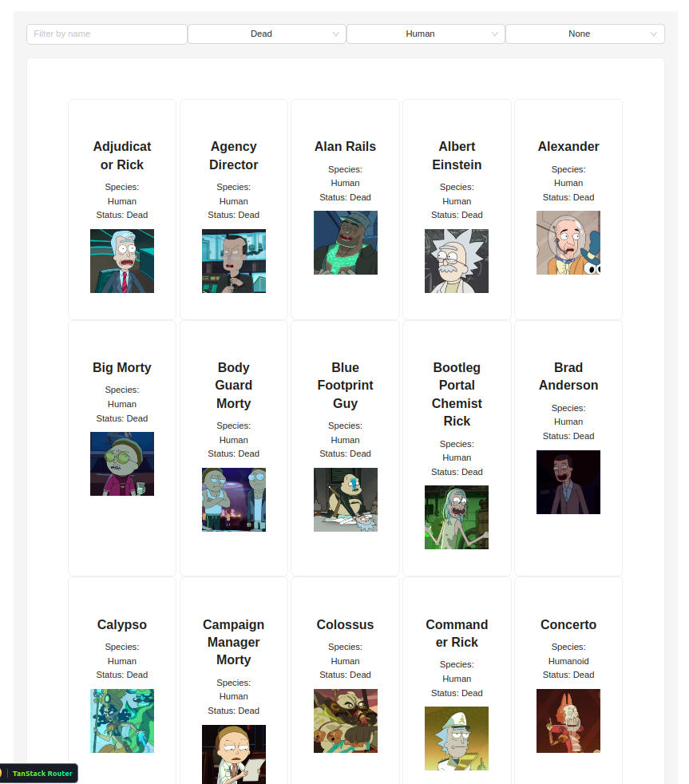

<h1>Rick and Morty API Web Application</h1>

<h3>Overview</h3>

This project focuses on developing a web application using React to explore characters from the "Rick and Morty" series. It utilizes the Rick and Morty API to fetch character data dynamically. Users can interact with an infinite scroll of characters and use features like sorting and filtering to locate their favorites efficiently.

<h3>Application Features</h3>

<ul>
<li>Character Display: Display characters along with details such as name, status, species, and image in an infinitely scrolling view.</li>
<li>Infinite Scrolling: Load and display more characters as the user scrolls down, replacing traditional pagination.</li>
<li>Sorting: Users can sort characters by name, status, or species.</li>
<li>Filtering: Implement filtering to view characters by specific criteria such as name, status, or species.</li>
<li>This should include debounce techniques to optimize performance and enhance user experience.</li>
<li>The search through filters will occur automatically as the user types, without the need to submit a search button, making the debounce implementation crucial for reducing excessive API calls.</li>
<li>Detailed View: Clicking on a character card shows more detailed information in a modal or a dedicated component.</li>
</ul>

<h3>Features</h3>

- Axios
- TanStack Router
- TanStack Query
- Ant Design (AntD)
- Debouncing